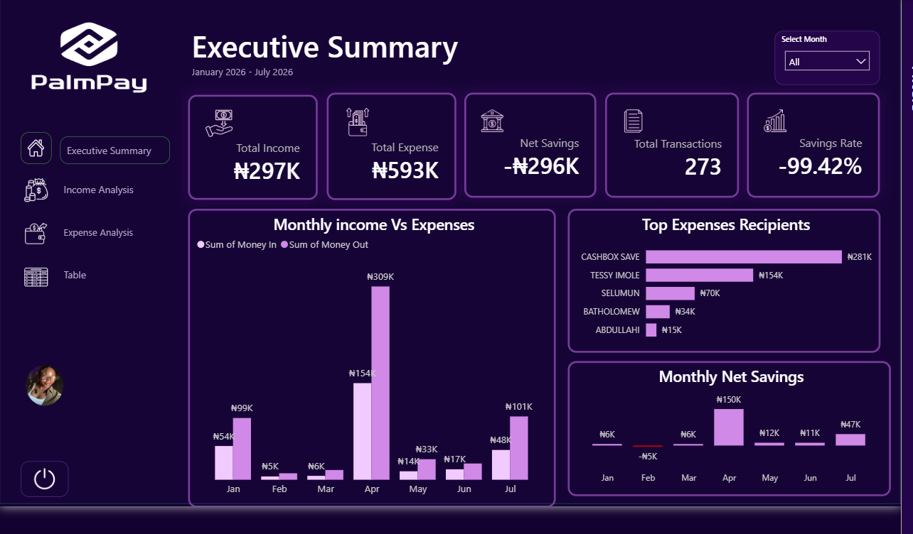
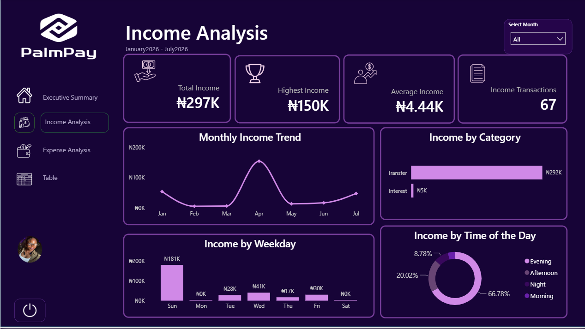
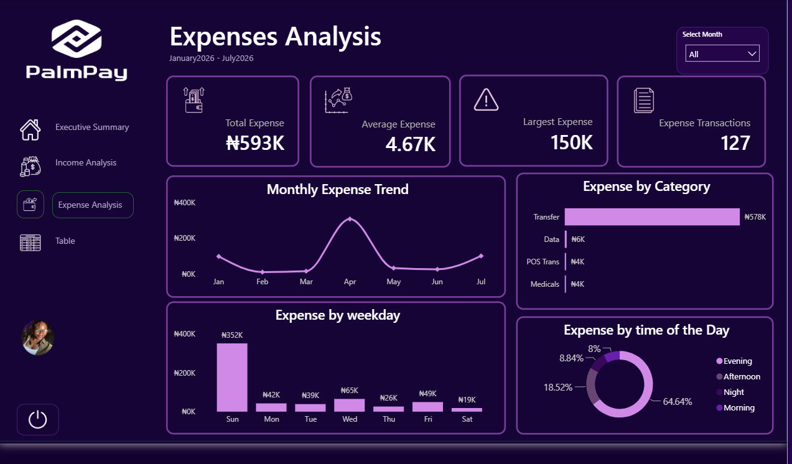

# 📊 PalmPay Transaction Analysis Dashboard

  

An end-to-end data analytics project that transforms raw PalmPay transaction history into an interactive financial dashboard using **Excel, Power Query, MySQL, and Power BI**.

---

## 📖 Project Overview

Managing personal finances becomes easier when transaction data is transformed into meaningful insights. This project analyses PalmPay transaction history from **January 2026 to July 2026**, uncovering trends in income, expenses, savings, and transaction behaviour.

The project follows a complete data analytics workflow—from data extraction and cleaning to SQL analysis, DAX calculations, and interactive dashboard development.

---

## 🎯 Project Objectives

- Analyse income and expense trends.
- Track monthly savings performance.
- Identify spending patterns.
- Discover major income sources and expense recipients.
- Analyse transaction behaviour by weekday and time of day.
- Build an interactive dashboard for financial decision-making.

---

## 🛠 Tools & Technologies

| Tool | Purpose |
|------|---------|
| Microsoft Excel | Initial data handling |
| Power Query | Data extraction, transformation and cleaning |
| MySQL | Data storage and exploratory data analysis |
| Power BI | Dashboard development |
| DAX | KPI calculations and dynamic measures |

---

## ⚙️ Project Workflow

### 1️⃣ Data Extraction

- Imported PalmPay transaction history.
- Converted PDF transaction records into structured tables using Power Query.
- Appended multiple tables into one dataset.

### 2️⃣ Data Cleaning

The dataset was cleaned using SQL:

- Removing duplicates
- Handling missing values
- Standardising column names
- Correcting data types
- Creating calculated columns
- Preparing the dataset for SQL

### 4️⃣ Power BI

The cleaned SQL dataset was connected to Power BI where:

- Relationships were created
- DAX measures were written
- KPIs were calculated
- Interactive dashboards were designed

---

## 📊 Dashboard Pages

## 🏠 Welcome Page

The landing page provides navigation buttons that allow users to move seamlessly across the report.

---

### 📈 Executive Summary

Provides an overview of:

- Total Income
- Total Expenses
- Net Savings
- Savings Rate
- Running Balance
- Monthly Trends
- Income vs Expense Comparison

---

### 💰 Income Analysis

Provides insights into:

- Monthly Income Trend
- Income Sources
- Income by Weekday
- Income by Time of Day
- Income Transactions
- Highest Income

---

### 💸 Expense Analysis

Provides insights into:

- Monthly Expense Trend
- Expense Categories
- Expense Recipients
- Expense by Weekday
- Expense by Time of Day
- Largest Expense
- Expense Transactions

---

# 📸 Dashboard Preview

## Welcome Page

---

## Executive Summary

---

## Income Analysis

---

## Expense Analysis

---

# 📈 Key Insights

This dashboard presents an analysis of PalmPay transactions from **January 2026 to July 2026**, providing insights into income, expenses, savings, and overall financial behaviour.

The analysis recorded a **total income of ₦297,000** and **total expenses of ₦593,000**, resulting in **net savings of -₦296,000** and a **savings rate of -99.42%**, indicating that expenditure exceeded income during the reporting period. Monthly trend analysis showed that **April** was the most financially active month, recording the highest income, highest expenses, and the strongest monthly net savings.

Further analysis revealed that **Transfers** accounted for the largest expense category, while **CashBox Save** was the top expense recipient, indicating that a significant portion of outgoing transfers represented savings. On the income side, **Interbank Transfers** contributed the largest share of income.

Transaction pattern analysis showed that most **income transactions occurred during the evening**, while **Sunday** recorded the highest transaction values for both income and expenses, revealing consistent financial activity on that day.

Overall, this project demonstrates an end-to-end data analytics workflow, from data preparation to interactive dashboard development using Excel, Power Query, MySQL, Power BI, and DAX.

---

# 📐 DAX Measures Created

- Total Income
- Total Expense
- Net Savings
- Savings Rate
- Running Balance
- Average Expense
- Average Income
- Highest Income
- Largest Expense
- Income Transactions
- Expense Transactions
- Income by Time of Day
- Expense by Time of Day

---

# 📂 Repository Structure

PalmPay-Transaction-Analysis
│
├── Data
├── Images
├── SQL
├── Power Query
├── Power BI
├── README.md

# 🚀 Skills Demonstrated

- Data Cleaning
- Data Transformation
- Power Query
- SQL
- Exploratory Data Analysis (EDA)
- Data Modelling
- DAX
- Power BI
- Dashboard Design
- Data Visualisation
- Financial Data Analysis

---

# 👩🏽‍💻 Author

**Salome Aondoakaa**

** Data Analyst**

If you found this project interesting, feel free to ⭐ this repository or connect with me on LinkedIn.
